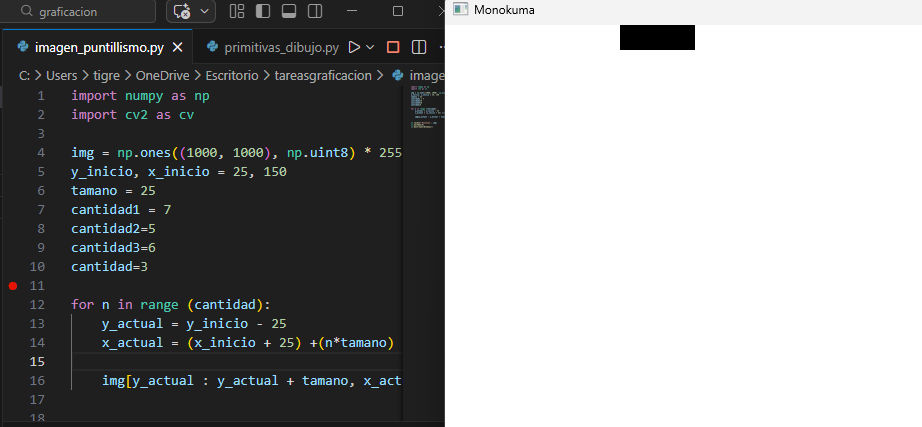
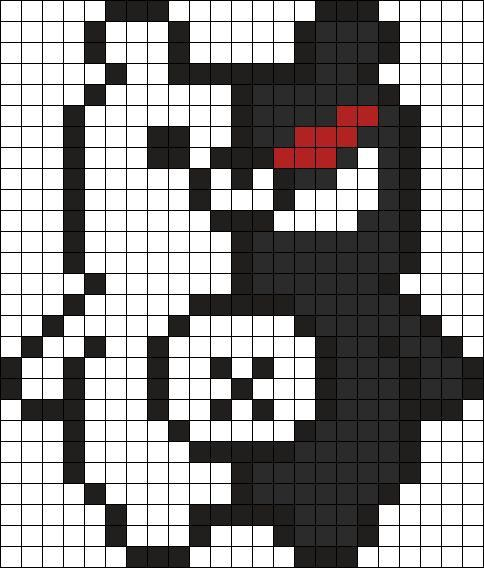
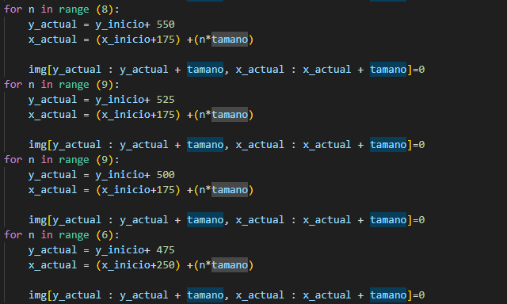
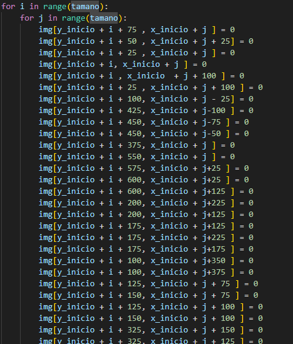
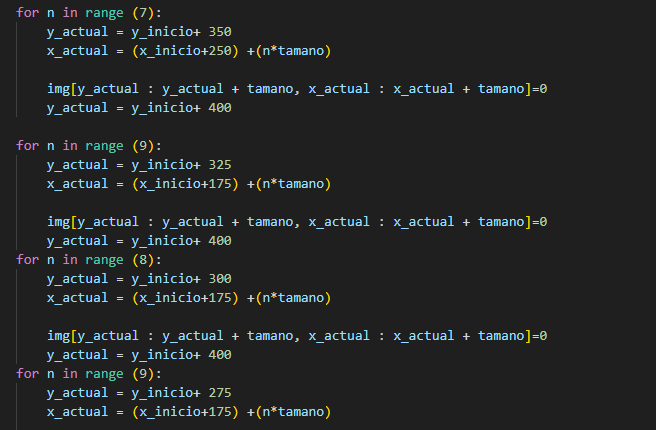
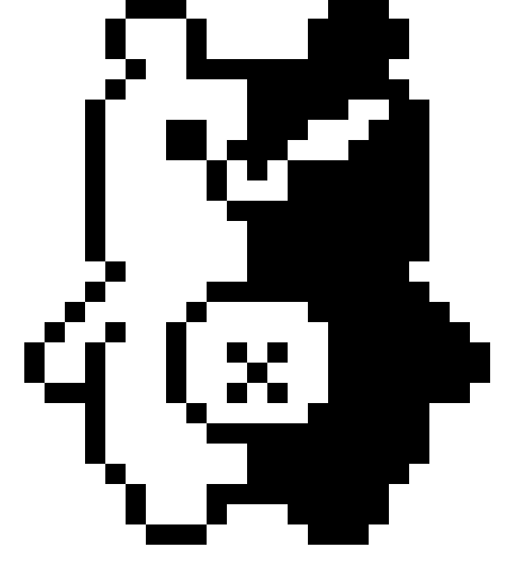

# Reporte Imagen Puntillismo Monokuma

Reporte Imagen puntillismo Monokuma

Lo primero que hice fue intentar crear un cuadrado con un for,, para eso cree un lienzo en blanco de 1000 x 1000 , asigne un tamaño a mi cuadrado de 25 y después asigne su ubicación en el lienzo con y_inicio y x_inicio dándole las primeras coordenadas.

Al ver que el ciclo funcionaba conté cuantos cuadrados se repetían el la imagen en la que base mi dibujo . Al notar que en el dibujo se agrupaban mayormente grupos de 3,6,5 y 7 cuadrados procedí a asignar cantidades por los ciclos en lugar de solo asignar el rango.

Al conocer la primera coordenada de la imagen y el tamaño de los cuadrados con eso me base para saber la siguiente coordenada, si por ejemplo el primer ciclo comenzaba en y_inicio-25, x_inicio +25 yo sabia que el siguiente cuadrado estaría y_inicio y en x_inicio, pues con el tamaño de 25 asignado solo tenia que sumar ese 25 en y para bajar , y +25 en x para moverme hacia la derecha, asi es como sabia donde colocar el siguiente cuadrado y el siguiente ciclo.

Para el lado izquierdo como se tenia quedar en blanco y solo los bordes con cuadrados cree un solo ciclo donde coloque las coordenadas de todos esos cuadrados por separado para que el código se viera mas limpio.

Del lado derecho era más fácil pues solo debía de contar la cantidad de cuadrados empezando desde abajo y colocar los rangos.

Asi me fui hasta terminar
