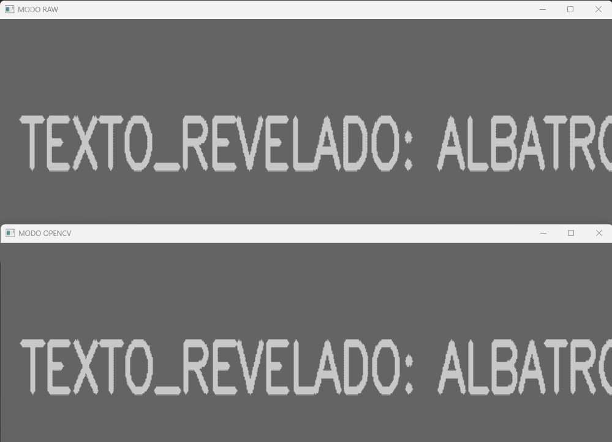
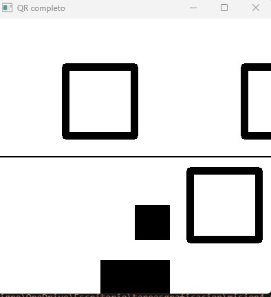
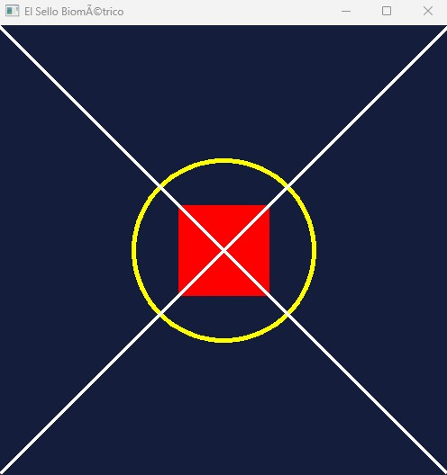
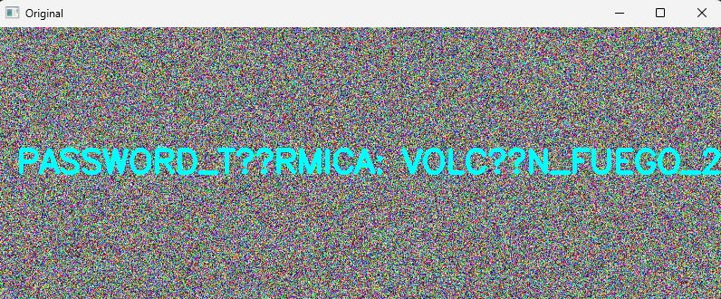
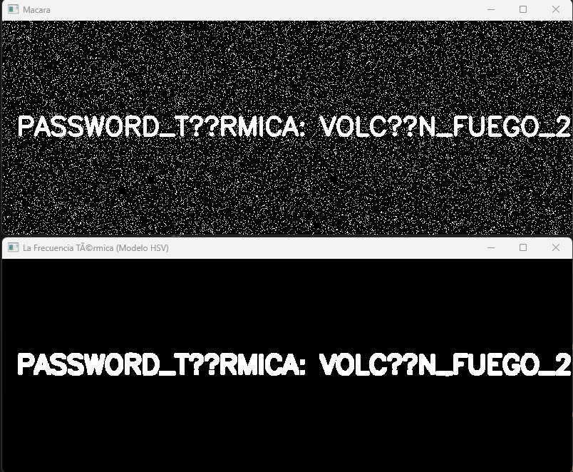
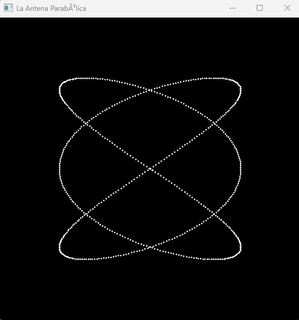

#  Reporte de Misión: Graficación Táctica
**Agente Especial:** [Nadia Coria Aragon ---- 24120411 ]

---
##  Evidencias de Misión
## Mision 1
# Codigo

```python
import cv2
import numpy as np

# Cargo la imagen desde la carpeta de descargas
img_oscura = cv2.imread(r'C:\Users\tigre\Downloads\m1_oscura.png')
img_redim = cv2.resize(img_oscura, (1000, 400))

# --- MODO RAW (CON LOS FOR) ---
# Hago una copia porque si no se cambia la original
resultado1 = img_redim.copy()

# Recorro alto y ancho
for y in range(0, resultado1.shape[0]):
    for x in range(0, resultado1.shape[1]):
        for c in range(0, 3):
            # multiplico por 50 
            valor = float(resultado1[y, x, c]) * 50
            
            # esto es para que no explote el color (maximo 255)
            if valor > 255:
                resultado1[y, x, c] = 255
            else:
                resultado1[y, x, c] = int(valor)

# --- MODO OPENCV ---
resultado2 = cv2.multiply(img_redim, 50)

# Muestro los resultados
cv2.imshow('MODO RAW', resultado1)
cv2.imshow('MODO OPENCV', resultado2)


cv2.waitKey(0)
cv2.destroyAllWindows()
```
# Resultado

## Mision 2
# Codigo 

```python
import cv2
import numpy as np

parte1 = cv2.imread(r'C:\Users\tigre\Downloads\m2_mitad1.png')
parte2 = cv2.imread(r'C:\Users\tigre\Downloads\m2_mitad2.png')

lienzo_final = np.zeros((400, 400, 3), np.uint8)

# Trasladar la mitad 1

M_traslacion = np.float32([[1, 0, 0], [0, 1, 0]])
# aplico el warpAffine 
mitad1_lista = cv2.warpAffine(parte1, M_traslacion, (400, 200))
lienzo_final[0:200, 0:400] = mitad1_lista

#  Rota la mitad 2
alto2 = parte2.shape[0]
ancho2 = parte2.shape[1]
# el centro es la mitad de la imagen
centro_profe = (ancho2 // 2, alto2 // 2)

# rotacion 180
M_rotar = cv2.getRotationMatrix2D(centro_profe, 180, 1)
mitad2_derecha = cv2.warpAffine(parte2, M_rotar, (ancho2, alto2))
lienzo_final[200:400, 0:400] = mitad2_derecha

# resultado final 
cv2.imshow('QR completo', lienzo_final)

cv2.waitKey(0)
cv2.destroyAllWindows()
```
# Resultado

## Mision 3
# Codigo

```python
import cv2
import numpy as np

# lienzo de 500x500
# azul oscuro BGR(50, 20, 20)


# primero hago el fondo negro con np.zeros
sello = np.zeros((500, 500, 3), np.uint8)

# color azul oscuro a todo el fondo
sello[:] = (60, 30, 20) 

# Creando el circulo amarillo 
centro = (250, 250)
radio = 100
color_amarillo = (0, 255, 255)
cv2.circle(sello, centro, radio, color_amarillo, 3)

#rectangulo rojo solido (200,200) a (300,300)
# Para que sea solido (relleno) hay que poner -1 en el grosor
cv2.rectangle(sello, (200, 200), (300, 300), (0, 0, 255),-1)

# lineas blancas cruzadas
#  esquina a esquina seria de (0,0) a (500,500)
cv2.line(sello, (0, 0), (500, 500), (255, 255, 255),2)
cv2.line(sello, (500, 0), (0, 500), (255, 255, 255), 2)

# 5. Guardar el dibujo
cv2.imwrite('m3_sello_forjado.png', sello)


cv2.imshow('El Sello Biométrico', sello)


cv2.waitKey(0)
cv2.destroyAllWindows()
```
# Resultado


## Mision 4
# Codigo

```python
import cv2
import numpy as np

foto_ruido = cv2.imread(r'C:\Users\tigre\Downloads\m4_ruido.png')

imagen_hsv = cv2.cvtColor(foto_ruido, cv2.COLOR_BGR2HSV)

# Cyan = 90
bajo = np.array([80, 100, 100])
alto = np.array([100, 255, 255])

mascara = cv2.inRange(imagen_hsv, bajo, alto)
 #limpiando los puntos blancos 
kernel = np.ones((3,3), np.uint8)
clean = cv2.morphologyEx(mascara, cv2.MORPH_OPEN, kernel)
final = cv2.dilate(clean, kernel, iterations=1)

cv2.imshow('Original', foto_ruido)
cv2.imshow('Macara', mascara)
cv2.imshow('La Frecuencia Térmica (Modelo HSV)', final)


cv2.waitKey(0)
cv2.destroyAllWindows()
```
# Resultado



## Mision 5
# Codigo

```python
import math 
import cv2
import numpy as np

resultado_final = np.zeros((500, 500, 3), np.uint8)
t = 0.0
# para que no queden huecos en el dibujo
salto = 0.01 

# t va hasta 2*pi (6.28 mas o menos)
while t < 6.29:
    x_calculada = 250 + 150 * math.sin(3 * t)
    y_calculada = 250 + 150 * math.sin(2 * t)
    
    # tuve que poner int() porque cv2.circle no acepta decimales y me tiraba error el programa
    punto_x = int(x_calculada)
    punto_y = int(y_calculada)
    
    cv2.circle(resultado_final, (punto_x, punto_y), 1, (255, 255, 255), -1)
    t = t + salto

cv2.imshow('La Antena Parabólica', resultado_final)
cv2.waitKey(0)
cv2.destroyAllWindows()
```
# Resultado


---
##  Análisis del Analista (Reflexiones Finales)

1. **Sobre los Operadores Puntuales (Misión 1):** Matemáticamente, ¿qué pasaría si en lugar de multiplicar por 50, hubieras sumado 50 a cada píxel oscuro? ¿Se revelaría el texto igual de claro o la imagen perdería contraste?
> *[Escribe tu respuesta aquí]*

2. **Sobre el Espacio HSV (Misión 4):** ¿Por qué el modelo de color BGR es ineficiente para la Recuperación de Información cuando buscamos "todos los tonos de azul celeste", y por qué el modelo HSV resuelve este problema con una sola variable?
> *[Escribe tu respuesta aquí]*

3. **Sobre Ecuaciones Paramétricas (Misión 5):** ¿Por qué las ecuaciones paramétricas (usando el parámetro t) son mejores para dibujar formas cerradas y complejas en graficación por computadora que usar la clásica función $y=f(x)$?
> *[Escribe tu respuesta aquí]*
