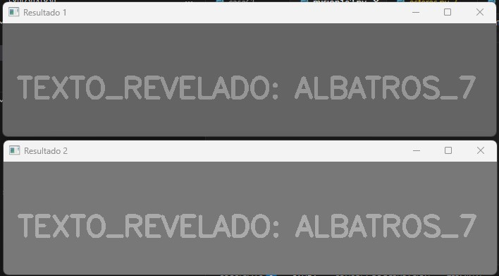
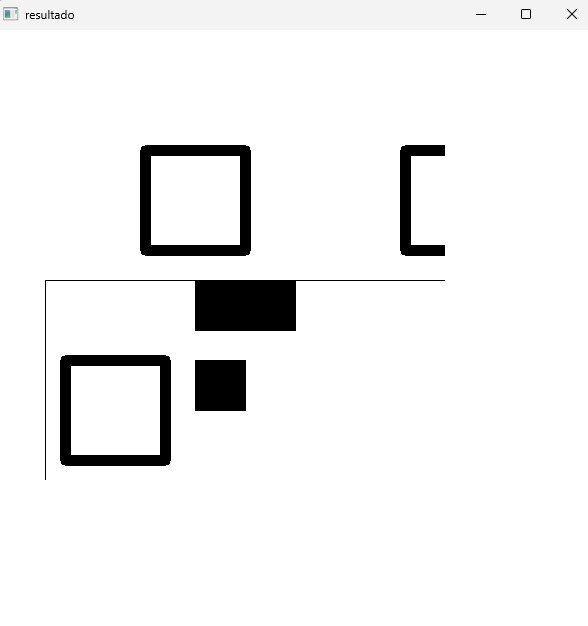

# Reporte de Misión: Graficación Táctica II
**Agente Especial:** [Nadia Coria Aragon /24120411]

---
## Evidencias
### Misión 1
- Imagen recuperada x50: (inserta)
- Imagen recuperada x50 + 20: (inserta)
- Código:
```python
import cv2
import numpy as np

ruta_imagen = r'C:\Users\tigre\Downloads\m1_oscura 1.png'
foto = cv2.imread(ruta_imagen, 0)

if foto is not None:
    alto, ancho = foto.shape
    
    capa1 = np.zeros((alto, ancho), dtype=np.int32)
    for i in range(0, alto):
        for j in range(0, ancho):
            pixel = foto[i, j]
            nuevo_p = pixel * 50
            if nuevo_p > 255:
                nuevo_p = 255
            capa1[i, j] = nuevo_p

    capa2 = np.zeros((alto, ancho), dtype=np.int32)
    for i in range(alto):
        for j in range(ancho):
            val = foto[i, j]
            res = (val * 50) + 20
            if res > 255:
                res = 255
            if res < 0:
                res = 0
            capa2[i, j] = res

    final1 = capa1.astype(np.uint8)
    final2 = capa2.astype(np.uint8)

    cv2.imshow('Resultado 1', final1)
    cv2.imshow('Resultado 2', final2)
    
    print("Mostrando imagenes...")
    cv2.waitKey(0)
    cv2.destroyAllWindows()
else:
    print("no se encontro el archivo")


```
# Resultado


### Misión 2
- QR reconstruido: (inserta)
- Código:
```python
import cv2
import numpy as np

m1 = cv2.imread(r'C:\Users\tigre\Downloads\m2_mitad1.png')
m2 = cv2.imread(r'C:\Users\tigre\Downloads\m2_mitad2.png')
lienzo = np.full((600, 600, 3), 255, dtype=np.uint8)

if m1 is not None and m2 is not None:
    h1, w1 = m1.shape[:2]
    h2, w2 = m2.shape[:2]

    # Mitad 1
    m_t = np.float32([[1, 0, 0], [0, 1, 0]])
    p1 = cv2.warpAffine(m1, m_t, (w1, h1))

    # Mitad 2
    c = (w2 // 2, h2 // 2)
    m_r = cv2.getRotationMatrix2D(c, 180, 1.0)
    p2 = cv2.warpAffine(m2, m_r, (w2, h2))

    y = 50
    x = 50
   
    lienzo[y : y + h1, x : x + w1] = p1
    lienzo[y + h1 : y + h1 + h2, x : x + w2] = p2

    cv2.imwrite(" qr reconstruido.png", lienzo)
    cv2.imshow("resultado", lienzo)
    cv2.waitKey(0)
    cv2.destroyAllWindows()
else:
    print("error con la ruta de las imagenes")


```
# Resultado


### Misión 3
- Sello forjado: (inserta)
- Código:

### Misión 4
- Máscara Cyan: (inserta)
- Código:

### Misión 5
- Evidencia tricolor: (inserta)
- Mensaje recuperado: (inserta)
- Código:

---
## Análisis del Analista (Reflexiones Finales)

1. **Operadores puntuales (M1):** ¿Qué diferencia visual hay entre recuperar con multiplicación (x50) y recuperar con suma (+50)? ¿Cuál preserva mejor el contraste del texto?
> [Respuesta]

2. **Transformaciones geométricas (M2):** ¿Por qué es importante escoger el centro correcto al rotar una imagen con `getRotationMatrix2D`?
> [Respuesta]

3. **Convolución (M4):** ¿Por qué un filtro promedio puede ayudar a reducir falsos positivos antes de segmentar por HSV, y qué desventaja tiene sobre los bordes del texto?
> [Respuesta]

4. **Canales (M5):** ¿Por qué separar canales puede revelar información que en la imagen a color “no se ve” a simple vista?
> [Respuesta]
