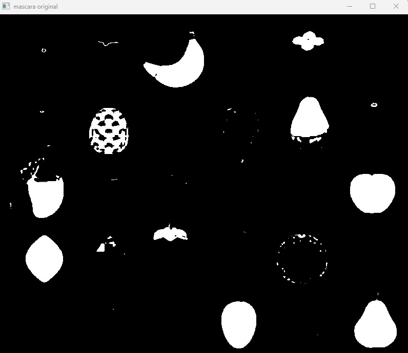

# Reporte Segmentacion de frutas
En esta practica trabajamos la mascara binaria con rango HSV   

# Actividad 1
Seleccionamops el color amarillo y ajustamos el rango HSV para que la mascara detectara solamente el color amarillo 

```python
#     # actividad 1 detectar los colores amarillos
    lower_yellow = np.array([20, 100, 100])
    upper_yellow = np.array([35, 255, 255])
    mask = cv2.inRange(hsv, lower_yellow, upper_yellow)
```
Preguntas: ¿Qué ocurre cuando el rango es muy estrecho?
Pierdes información. Si el rango es muy pequeño (por ejemplo, de 25 a 27), solo detectarás el amarillo un tipo de amarillo. Como las frutas tienen sombras, brillos y variaciones de madurez, muchas partes del objeto quedarán fuera de la máscara, resultando en objetos "huecos" o fragmentados.

¿Qué ocurre cuando el rango es muy amplio?
La máscara se vuelve "ruidosa". Se detectan variaciones de colores . Además, es probable que objetos que no son frutas aparezcan en la máscara, lo que causará falsos positivos en el conteo.

# Actividad 2
En esta actividad hacemos una limpieza y quitamos en ruido.
```python
#  # actividad 2 quitar el "ruido"
    kernel = np.ones((5,5), np.uint8)
    mask_open = cv2.morphologyEx(mask, cv2.MORPH_OPEN, kernel)
    mask_final = cv2.morphologyEx(mask_open, cv2.MORPH_CLOSE, kernel)
```
Preguntas: ¿Qué tipo de ruido aparece?
Principalmente aparecen dos tipos después de aplicar cv2.inRange:

#Salt and Peppe: Pequeños puntos blancos dispersos donde el sensor de la cámara interpretó mal el color o hubo un brillo pequeño.

#Fragmentación: Pequeños grupos de píxeles que cumplen la condición de color pero no pertenecen a una fruta (ruido de fondo).

#¿Por qué es necesario eliminarlo antes del conteo?
Si no limpias el ruido, el script contará cada pequeño punto blanco como si fuera una fruta, arrojando un número inflado.
# Actividad 3
Ahora identificamos las frutas y las contamos, aunque ya quimos el ruido tambien especificamos que cuanete las areas de un determinado tamaño para evitar que cuente objetos muy pequeños .

```python
#     # aqui se aplica un filtro para que solo cuante las areas grandes de color amerillo para no contar pequeños segmentos
    conteo = 0
    for i in range(1, num_labels):
        area = stats[i, cv2.CC_STAT_AREA]
        if area > 500: 
            conteo += 1

    print(f"total del conteo: {conteo}")

```

# RESULTADOS MASCARA AMARILLA 



